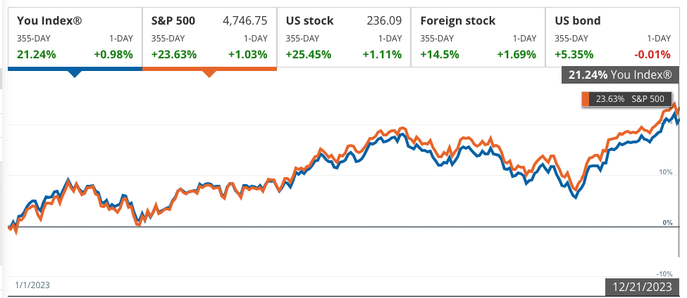

# End of Year Financial Checklist

- Last Updated: 2023-12-21

The end of a calendar year is usually a good time to do some financial housekeeping. It's better to consider these things at the end of the year because there are some things if you don't take advantage of before the end of the year (e.g. FSAs or tax loss harvesting), you lose the opportunity to do so.

**Use FSA or Other Use-It-or-Lose-It Funds**: Spend any remaining funds in your Flexible Spending Account (FSA) or similar accounts, as these funds often expire at year's end. This is a good time to make eligible purchases such as prescription glasses, dental work, or other qualifying healthcare expenses. (Deadline is December 31st)

**Tax Loss Harvesting**: If you have investments that have a loss, you can sell them to realize losses and use them to either offset capital gains or write off up to $3,000 (in 2023) of losses against income like wages. If you have more than $3,000 you can also carry forward your losses and deduct them in future tax years.

**Maximize Retirement Contributions**: Max out contributions to retirement accounts like 401(k)s and IRAs (Traditional or Roth) to boost retirement savings and potentially lower your taxable income. The deadline for 401k contributions is December 31st. The deadline to contribute to an IRA is the following tax due date. For 2023 contributions, this would be April 15, 2024. If your income is too high to contribute to a Roth IRA, you can always do a [Backdoor Roth IRA](https://thefinancebuff.com/the-backdoor-roth-ira-a-complete-how-to.html).

**Analyze your investment performance**: Evaluate your investments and consider rebalancing to maintain your desired asset allocation. If you aren't invested in index funds, compare your returns against an appropriate benchmark like the S&P500 to evaluate any under or overpeformance. I use Empower's Personal Dashboard with my investment accounts linked to calculate this for me. 2023 has been a good year for buy a hold investors like myself. My underperformance to the S&P500 is largely explained by my allocation to international (30%). If you're interested, you can sign up for Empower using this [referral link](https://empowerreferral.link/lawrencewu).

**Rebalance Investments**: If your investments aren't in a one-fund solution that automatically rebalances, manually adjust your portfolio to maintain your desired asset allocation. This helps in managing risk and ensuring your investment strategy stays on track.

**Cancel Unused Subscriptions**: Review and cancel any subscriptions or memberships you no longer use. This can lead to significant savings by eliminating recurring, often overlooked expenses.

**Update your Net Worth Statement**: I have a spreadsheet where I track my net worth each year. This involves calculating the total value of all your assets (such as cash, investments, property) and subtracting your liabilities (like loans, credit card debt). This exercise provides a clear picture of your financial health and helps track progress towards your financial goals. It can also reveal areas that need attention, such as high debt levels or underperforming investments, guiding your financial decisions for the upcoming year. I also use [Empower](https://empowerreferral.link/lawrencewu) to quickly find the balances of all of my asset and liability accounts.

**Consider a Roth Conversion**: The deadline to convert a traditional IRA to a Roth IRA is December 29, 2023. This involves paying taxes now on the converted amount, but future withdrawals from the Roth IRA would be tax free.

**Donate to Charity**: As the year ends, consider donating to charities. Remember, donations aren’t limited to cash; you can also donate goods or appreciated securities. In 2023, you can deduct 60% of your AGI (adjusted gross income). This is limited to 30% of AGI for non-cash contributions like appreciated stock.

**Consider Donating Appreciated Shares**: On the topic of donating appreciated shares, donating securities that have increased in value, like stocks or mutual funds, to charity is a strategic financial move, especially if you've held them for over a year. This approach allows you to avoid paying capital gains taxes on the increase in value since you purchased them. Moreover, if you itemize deductions, you can also claim a tax deduction for the full fair market value of the shares at the time of the donation. This double benefit makes donating appreciated shares one of the most tax-efficient ways to support charitable causes. It's a win-win situation: you maximize your contribution to the charity while minimizing your tax liability.

**Consider Donation Bunching**: This strategy involves consolidating multiple years' worth of charitable donations into a single year. The idea is to exceed the standard deduction in that year, making it possible to itemize deductions and gain a larger tax benefit. For example, if you typically donate annually, you might choose to bunch two or more years' worth of donations into one year. 

For example if you are MFJ and have $10,000 of charitable contributions, $10,000 mortgage interest and $7,000 SALT (state and local property taxes), you are just below the standard deduction of $27,700 in 2023. Therefore, when you file your taxes, you would take the standard deduction and not itemize. 

If you were to give next year's donations ($10,000) this year, you would be able to itemize your deductions since the total deductions would be $32,000 ($10k 2023 donations, $10k 2024 donations given in 2023, $5k mortgage interest and $7k SALT). Over a two year period, without bunching, your deductions would just be the sum of two standard deductions or $56,900. With bunching, your deductions would be itemized deductions in one year and the standard in the next or $61,200 in the example above. If you are in the 22% federal and 9.3% state tax bracket, you would save around $1,300 in taxes.

See the example worked out below.

|                     | **Without Bunching (2 years)** |        | **With Bunching 2 years** |        |
|---------------------|:------------------------------:|-------:|:-------------------------:|-------:|
|                     |             **2023**           | **2024** |           **2023**          | **2024** |
| Charitable Contributions |             $10,000           | $10,000 |           $20,000           |   $0    |
| Mortgage Interest   |             $5,000             | $5,000 |           $5,000            | $5,000 |
| SALT (State and Local Property Taxes, 10k max) |             $10,000            | $10,000 |           $7,000            | $7,000 |
| Itemized Deductions |             $25,000            | $25,000 |           $32,000           | $12,000 |
| Standard Deduction  |             $27,700            | $29,200 |           $27,700           | $29,200 |
| Total Deduction     |             $27,700            | $29,200 |           $32,000           | $29,200 |
| **Total Deduction (2 years)** |                        | $56,900 |                           | $61,200 |

|                           | **Difference in Deduction** |       |
|---------------------------|----------------------------:|------:|
| Difference in Deduction   |                      $4,300 |       |
| Federal Marginal Tax Rate |                        22%  | $946  |
| State Marginal Tax Rate   |                       9.30% | $400  |
| Total Tax Rate            |                      31.30% | $1,346 |

Here is a [Google Sheet template](https://docs.google.com/spreadsheets/d/18y7RAZ8A4GlAp99_udxMRquSYq2U9PxKyvtvLB-uaWU/edit#gid=0) you can copy and input your own numbers to get a sense of the potential tax benefit.